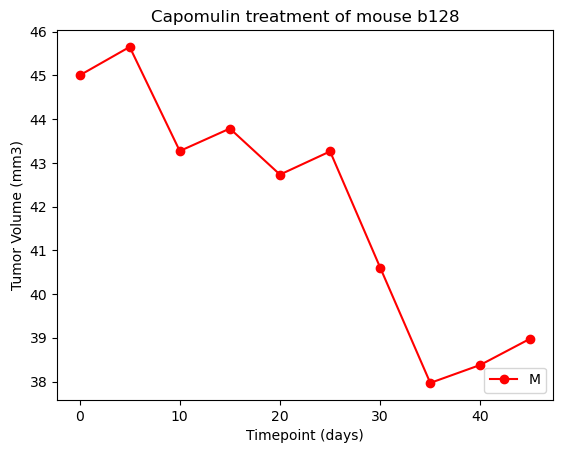
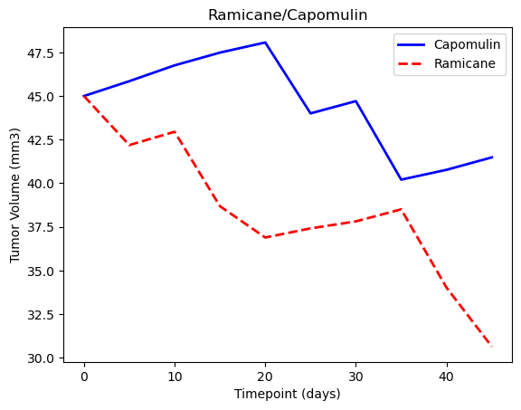

# matplotlib-challenge

In the previous project, we learned how to use Pandas to display our data in well organized dataframes matching our needs.
In this project we will learn how we can use other libraries to include a statistics summary and to draw charts and plots for better reading and analysis: 📊

In this project, we will study a new pharmaceutical company that specializes in anti-cancer medications. Recently, it began screening for potential treatments for squamous cell carcinoma (SCC), a commonly occurring form of skin cancer. In this study, 249 mice that were identified with SCC tumors received treatment with a range of drug regimens. Over the course of 45 days, tumor development was observed and measured. The purpose of this study was to compare the performance of Pymaceuticals’ drug of interest, Capomulin, with the other treatment regimens.
What we will learn from this project:

- How to generate a Summary Statistics: Mean,	Median, Variance, Standard deviation and Standard error.

- How to generate Bar and Pie Charts using Pandas and pyplot
  
- How to calculate Quartiles, Find Outliers, and Create a Box Plot

- How to generate a line plot

- How to generate a scatter plot

- How to calculate the correlation coefficient and a linear regression model 

Instructions:

Prepare the data.

Generate summary statistics.

Create bar charts and pie charts.

Calculate quartiles, find outliers, and create a box plot.

Create a line plot and a scatter plot.

Calculate correlation and regression.

All this information will be used for a subsequent deeper analysis

1. Prepare the Data
   
- Merge our datasets into a single DataFrame.

- Look for the number of unique mice in the data, and check for any duplication of the identifyer (our data is identified by Mouse ID and Timepoint). Clear the DataFrame of the duplicate rows.

2. Generate Summary Statistics
   
- Create a DataFrame of summary statistics including:  mean, median, variance, standard deviation, and SEM of the tumor volume.

3. Create Bar Charts and Pie Charts
   
- Generate two bar charts showing the total number of rows (Mouse ID/Timepoints) for each drug regimen throughout the study.Use the Pandas DataFrame.plot() method and Matplotlib's pyplot methods.

- Generate two pie charts showing the distribution of female versus male mice in the study. Use the Pandas DataFrame.plot() method and  Matplotlib's pyplot methods. 

4. Calculate Quartiles, Find Outliers, and Create a Box Plot
   
- Calculate the final tumor volume of each mouse across four of the most promising treatment regimens: Capomulin, Ramicane, Infubinol, and Ceftamin. Then, calculate the quartiles and IQR, and determine if there are any potential outliers across all four treatment regimens. 

- Using Matplotlib, generate a box plot that shows the distribution of the final tumor volume for all the mice in each treatment group. Highlight any potential outliers in the plot.

5. Create a Line Plot and a Scatter Plot
   
- Select a single mouse that was treated with Capomulin, and generate a line plot of tumor volume versus time point for that mouse.

- Generate a scatter plot of mouse weight versus average observed tumor volume for the entire Capomulin treatment regimen.

6. Calculate Correlation and Regression
   
- Calculate the correlation coefficient and linear regression model between mouse weight and average observed tumor volume for the entire Capomulin treatment regimen.

- Plot the linear regression model on top of the previous scatter plot.

Program:

Tools:

- Pandas: it is a Python library for data manipulation and analysis

- Matplotlib.pyplot:  Matplotlib has a module named pyplot which makes things easy for plotting by providing features to control line styles, font properties, formatting axes etc. Matplotlib is a python library used to create 2D graphs and plots by using python scripts.

- scipy.stats: it is a module that contains a large number of probability distributions.

- Jupyter Notebook: it is a web-based interactive computing platform that allows the user to compile all aspects of a data project.

Code to generate charts using pyplot methods
## Bar Charts
```
# Generate a bar plot showing the total number of rows (Mouse ID/Timepoints) for each drug regimen using pyplot.

# prepare x axis and y_axis
x_axis = np.arange(len(mice_per_regimen ))
y_axis = mice_per_regimen['Mouse ID'] 
l=mice_per_regimen['Mouse ID'].max()
# create ticks 
x= mice_per_regimen.index.values
tick_location = [value for value in x_axis]
plt.xticks(tick_location, x,rotation="vertical") 
# creatte the plot
plt.bar(x_axis,y_axis, color='r', alpha=0.5,align = 'center')
# Set x and y limits
plt.xlim(-1, len(x_axis))
plt.ylim(0,l+10)
#Title 
plt.title("Total Measurements per Drug Regimen \n")
#labels
plt.xlabel('Drug Regimen \n')
plt.ylabel('#of Observed Mouse Timepoints \n')
```
plt.legend('Mouse ID', loc='upper right', frameon=True)


## Pie Chart
# Pie plot showing the distribution of female versus male mice using pyplot
```
mouse_gender = study_result_complete["Sex"].value_counts()
explode = (0.1,0)
colors =["blue", "pink"]
labels = mouse_gender.index
#create a pie chart 
plt.pie(mouse_gender, explode=explode, labels=labels, colors = colors,
        autopct="%1.1f%%", shadow=True, startangle=90) 

plt.title("distribution of female versus male mice")
plt.legend(labels, loc='upper right')
plt.axis("equal")
plt.ylabel('Sex')
```


 

## Boxplots
# Box plot 
 ```
fig,ax = plt.subplots(figsize =(10, 7))
prop = dict(markerfacecolor='y', markersize=10,markeredgecolor='r')
ax.boxplot(tumor_vol_data,labels = treatments,flierprops=prop)
ax.set_title('Final tumor volume of each mouse across four of the treatment regimens\n')
ax.set_ylabel('Final Tumor Volume(mm3)\n')
ax.set_xlabel('\n Drug Regimen')
plt.show()
```


## Line Plot
```
# Line plot of tumor volume vs. time point for a single mouse treated with Capomulin
capomulin_table = study_result_complete.loc[study_result_complete['Drug Regimen'] == 'Capomulin']
mousedata = capomulin_table.loc[capomulin_table['Mouse ID']== 'l509']
x_axix =mousedata['Timepoint']
y_axis = mousedata['Tumor Volume (mm3)']
plt.plot(mousedata['Timepoint'],mousedata['Tumor Volume (mm3)'],color='r', label='', marker = 'o')
plt.xlabel('Timepoint (days)')
plt.ylabel('Tumor Volume (mm3)')
plt.legend('Mouse l509',loc='lower right')
plt.title( 'Capomulin treatment of mouse l509')
plt.show()
```


## Scatter Plots

```
# Scatter plot of mouse weight vs. the average observed tumor volume for the entire Capomulin regimen

capomulin_table = study_result_complete.loc[study_result_complete['Drug Regimen'] == "Capomulin"]


mice_group =capomulin_table.groupby(['Mouse ID']).mean()

av_tum =mice_group ['Tumor Volume (mm3)']

mouse_weight = mice_group['Weight (g)']

 #Create scatte rplot 
plt.scatter(mouse_weight, av_tum, marker='o', facecolors='blue', edgecolors='red',
              s=av_tum, alpha=0.75)
#title and labels 
plt.title( 'mouse weight vs. average tumor volume: Capomulin regimen \n')
plt.xlabel('Weight (g)')
plt.ylabel(' Average Tumor volume (mm3)')
plt.savefig('scatter.png')
'''
 
 
Tip:🪄
For a better analysis of the result of  Capomulin, generate lines plot of tumor volume vs. time point for more than one mouse treated.

 
For a good comparaison between Capomulin and Ramicane, generate a line plot of tumor volume vs. time point for two mice treated by the two different drug regimens

